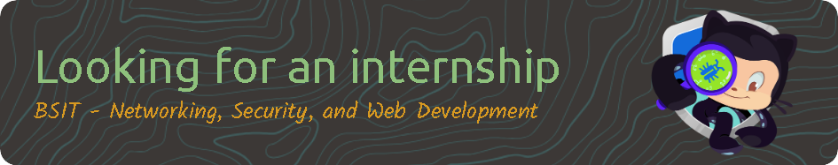

# Kumusta 👋, Welcome! I'm Victor ([Bleedmagic][steam])

<!-- 👀  -->

  

## 👨‍💻 About Me

- 🎯 **Goals**: I aim to be the most tech-savvy as I can be and contribute to projects!

- 🎲 **Hobbies**: I enjoy gaming, listening to music, and messing with configs in my free time.

- 💡 **Fun Fact**: The facemask stays on—even while coding.

> Check these out: [Bleedmagic's Gists][gh-gists] & [Page][gh-page]

## 💻 Tech Stack

    
    
    
    
    
     
    
    
    
    
    

 

    
    
    
    
    
     
    
    
    
    
        

## 📊 GitHub Stats

  
  
  </img>

## 🌟 Miscellaneus

Contents compiled from browsing the platform.

### A Wonderful Phrase

  

### Visit Count

    

### Pacman

<picture>
  <source media="(prefers-color-scheme: dark)" srcset="https://raw.githubusercontent.com/bleedmagic/bleedmagic/output/pacman/pacman-contribution-graph-dark.svg">
  <source media="(prefers-color-scheme: light)" srcset="https://raw.githubusercontent.com/bleedmagic/bleedmagic/output/pacman/pacman-contribution-graph.svg">
  
</picture>

### Profile Insights

- [gitstalk.netlify.app/bleedmagic](https://gitstalk.netlify.app/bleedmagic)
- [profile-summary-for-github.com/user/bleedmagic](https://profile-summary-for-github.com/user/bleedmagic)

---

> Carpe diem, quam minimum credula postero. :hourglass:

— Horace, Odes (Book 1, Poem 11)

[steam]: https://steamcommunity.com/profiles/76561198444268546

[gh-gists]: https://gist.github.com/bleedmagic

[gh-page]: https://bleedmagic.github.io/

<!-- 

    Made with 💖 by Victor (Bleedmagic) Vasquez [|87

 -->

<!-- @TODO Workflows: Metrics, Blog/Youtube -->
